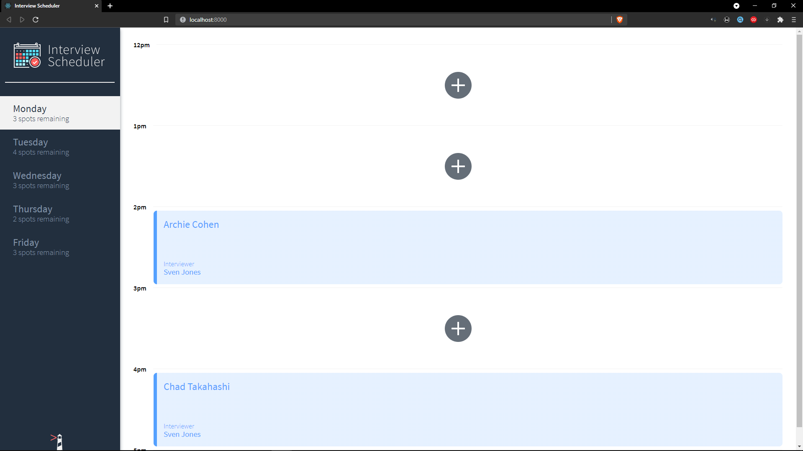

# Interview Scheduler
Interview Scheduler is a single plage application that allows users to book, edit or cancel appointments with their selected interviewer.

## Getting Started

- Clone the Repo.
- Install dependencies with `npm install`.
- Clone [scheduler-api](https://github.com/lighthouse-labs/scheduler-api) and run `npm install` in scheduler-api
- Run `npm start` in the root directory of scheduler-api
- Run `npm start` in root directory of scheduler

## Dependencies
  - [axios](https://www.npmjs.com/package/axios)
  - [classnames](https://www.npmjs.com/package/classnames)
  - [normalize.css](https://www.npmjs.com/package/normalize.css)
  - [react](https://www.npmjs.com/package/react)
  - [react-dom](https://www.npmjs.com/package/react-dom)
  - [react-scripts](https://www.npmjs.com/package/react-scripts)
